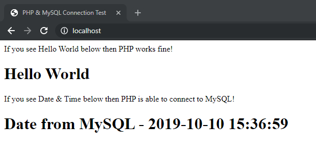

# Apache, PHP & MySQL Docker Image

****A repository to build a docker image with Apache, PHP and MySQL****

## Prerequisites
- Docker, Docker Compose
- preferably  Git Bash or WSL
</br>

## Installation

Clone or download the repository ***phpmysql***

```
https://github.com/Tarunls/phpmysql.git
```

Run the following commands from ***phpmysql*** folder
```
mkdir db && mkdir db/data
```
```
echo "AddType application/x-httpd-php .html .htm" > web/src/html/.htaccess
```

```
docker-compose up -d
```

once the docker build is complete run docker ps  command and check the containers are running
```
docker ps
```
Launch the browser and go to http://localhost. If all goes well it should look like below.



## Default Values

#### <u>Apache</u>
- apache runs in port 80
- apache /var/www/html is mapped to src/html
  
#### <u>MySQL</u>
- DB running on port 3306
- DB data folder mapped to **/db/data/**
- default root user password is **password**
- default database name is **mydb**
- default user name is **mysql**
- default user password is **mysql**
  

## Optional

Change the following parameters to customize the Apache & MySQL 

#### <u>Apache</u>
Modify the Dockerfile in the web folder
- EXPOSE to custom port numeber
- ADD src /var/www to custom folder

#### <u>MySQL</u>
Modify the docker-compose.yml
- modify **MYSQL_ROOT_PASSWORD** for root password
- modify **MYSQL_DATABASE** for root database name
- modify **MYSQL_USER** for db user name
- modify **MYSQL_PASSWORD** for db password
  
## Author
- ****Tarun Sankar****

## License

This project is licensed under the GNU GPLv3 License

****Do NOT distribute closed source versions of this project****